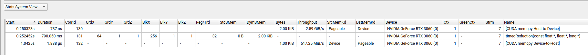

# Modified clock sample from CUDA Samples Github

## Description
### Refer to [CUDA GITHUB Clock Sample](https://github.com/NVIDIA/cuda-samples/tree/master/Samples/0_Introduction/clock) for original code.

This example shows how to use the clock function to measure the performance of block of threads of a kernel accurately.

## Key Concepts
1. The code here launches the cuda kernel with the configured threads and blocks where each thread would be assiging the input values to the shared memory for each block and then a reduction is performed to find minimum value out of all the input values. 
2. Please note that here random number generator is used to generate random numbers for input values . 
3. While assigning the input values, start time for that block is noted and when reduction functionality is completed, the end time of the block is noted and returned to host for finding out executoin time for that block . In the end , average of all block exeuction time is taken and shown as output value. 
4. Here each block would have allocated shared memory of value equal to 2 * NUM_THREAD * sizeof(float) while each block would have NUM_THREAD threads to execute that shared memory. 

## CUDA API Used
1. cudaGetDeviceCount - To get all GPU Hardware available 
2. cudaDeviceGetAttribute
   - Used to get the Multiprocessor Count using cudaDevAttrMultiProcessorCount as Attribute Parameter
   - Used to get cudaDevAttrClockRate for each GPU Hardware available
   - Above usage of cudaDevAttrClockRate and cudaDevAttrMultiProcessorCount is to get the maximum performant GPU device
      
3. cudaMalloc - Allocate Memory on the Device.
4. cudaMemcpy - To copy from Host to Device Memory and vice versa. Uses cudaMemcpyHostToDevice and cudaMemcpyDeviceToHost Attributes respectively.
5. cudaFree - Free Device allocated memory before exiting the program
6. __syncthreads - To synchronize all threads of a block and mark it completion of that block execution.

## Performance Profiling

## Supported  Architectures Where this code has been executed successfuly.
Device 0: "NVIDIA GeForce RTX 3060"
  CUDA Driver Version / Runtime Version          12.2 / 12.4
  CUDA Capability Major/Minor version number:    8.6
  Total amount of global memory:                 12044 MBytes (12629508096 bytes)
  (028) Multiprocessors, (128) CUDA Cores/MP:    3584 CUDA Cores
  GPU Max Clock rate:                            1792 MHz (1.79 GHz)
